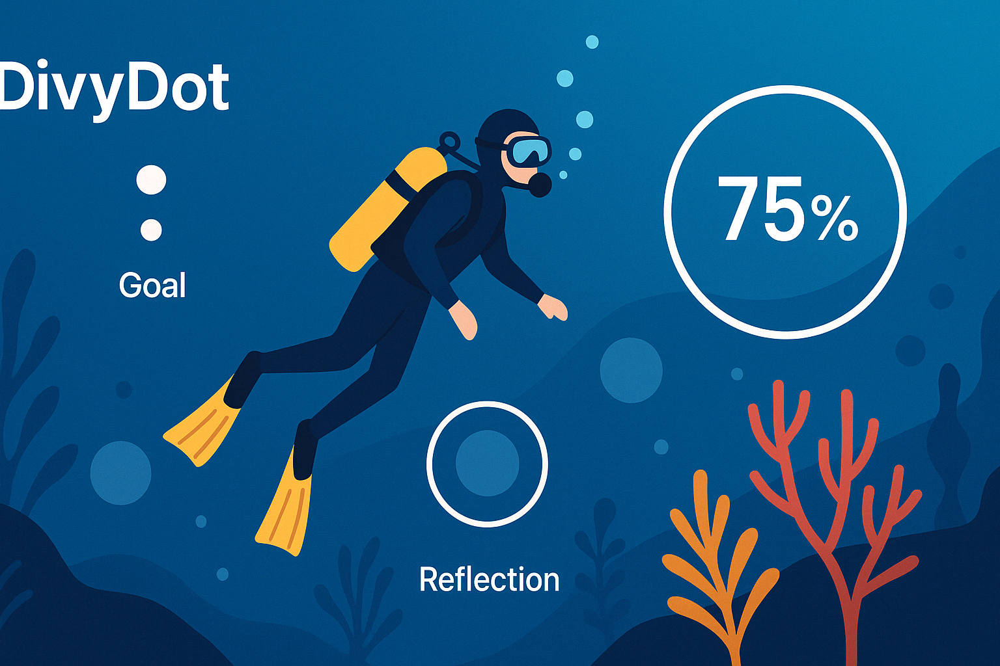
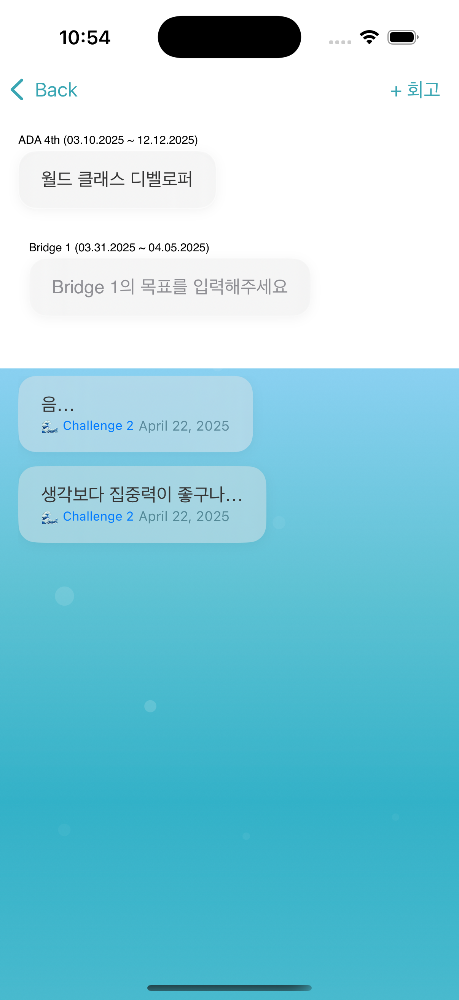
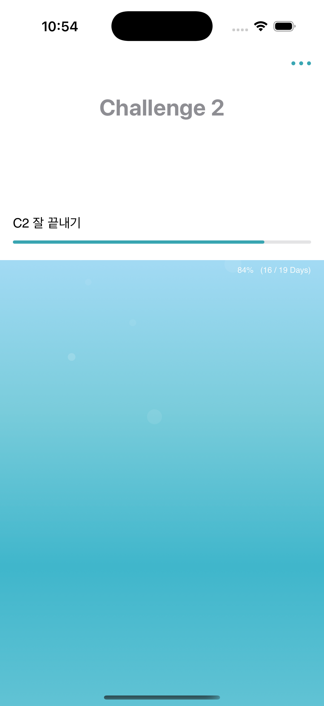

# 🌊 DivyDot

> 아카데미 여정을 해저 탐험에 비유하여,  
> 러너가 목표를 잊지 않고 지속적으로 리마인드하며 성장 방향을 확인할 수 있도록 돕는 앱입니다.

## 📌 프로젝트 개요

Apple Developer Academy의 긴 여정 속에서, 러너들은 자신만의 목표를 잃기 쉽습니다.  
**DivyDot**는 러너가 마치 다이버처럼 방향을 잃지 않고 여정을 완주할 수 있도록  
`목표 리마인드`, `회고`, `진행률 시각화` 등을 지원합니다.

## 🎯 핵심 목표

- 목표 설정 및 리마인드 문제 해결
- CLI → iOS 앱 전환 실험
- 감성적 인터페이스 구성 (회고 버블 등)
- 학습 흐름 구조화 (Exploratory Learning Cycle 기반)
- GitHub Issue & Milestone 기반 협업 실험
- SwiftData, MVVM 기반 앱 구조 설계 및 구현

## 🔁 Exploratory Learning Cycle

> Apple Developer Academy의 CBL 흐름을 바탕으로 한 프로젝트 구성입니다.

| Cycle | 내용 | 산출물 | 상태 |
|-------|------|--------|------|
| #1 | App Statement 수립 | App Statement | ✅ |
| #2 | 기능 도출 및 정리 | Feature List | ✅ |
| #3 | UI Flow 및 Lo-fi 설계 | Lo-fi Sketch | ✅ |
| #4 | Hifi + Task 연결 | Hifi & Task 구조 | ✅ |
| #5 | 구현 계획 수립 | Learning Plan | ✅ |
| #6 | 기능 재정비 | Feature List 2 | ✅ |
| #7 | 학습 백로그 정리 | Learning Backlog | ✅ |
| #8 | 학습 성과 체크 | 회고 및 점검 | 🔄 |
| #9 | 공유 및 발표 | 발표자료 | ⬜️ |

## ⚙️ 개발 환경

- macOS Sequoia 15.4
- Xcode 16.2 / iOS 18.2
- Swift 6.0.3
- SwiftUI

## 🧩 주요 기능

### 🔹 여정 추적
- 전체 여정 및 현재 Cycle 진행률 시각화
- 퍼센트 기반 진행률 + 항해 콘셉트 UI

### 🔹 목표 설정
- 사이클 별 목표 등록
- 목표 미등록 시 등록 유도 인터페이스
- TabView 기반 Cycle 전환
- 사이클-회고 데이터 연동 구조

### 🔹 회고 관리
- 회고(Reflection) 등록/수정/삭제
- 회고 버블 인터페이스 + 캡슐 형태의 카드 뷰
- 목표 연결 기반 데이터 구조화

### 🔹 감성적 UI 구성
- Bubble 배경 + Gradient 이중 Layer
- 날짜 기준 자동 Cycle 포커스
- TabView 기반 Cycle 전환 및 애니메이션
- 수영/다이버 모티프 적용 예정

## 📱 앱 미리보기

| Video | Launcher | Main | Detail |
|----------|------------|--------------|-------------|
| <video controls src="docs/assets/divydot.mp4" title="App Demo"></video> |  |  |  |

## 🙋🏻‍♀️ 작성자

| 이름 | GitHub |
|------|--------|
| Yang Seolin (Bisor0627) | [@bisor0627](https://github.com/bisor0627) |

## 📝 라이선스

이 프로젝트는 [MIT License](LICENSE)를 따릅니다.

## 📈 진행 상황

## 🗂 프로젝트 관리

- **[프로젝트 보드](https://github.com/users/bisor0627/projects/5)**  
- **[이슈 현황](https://github.com/bisor0627/DiverCompass/issues)**  
  
  