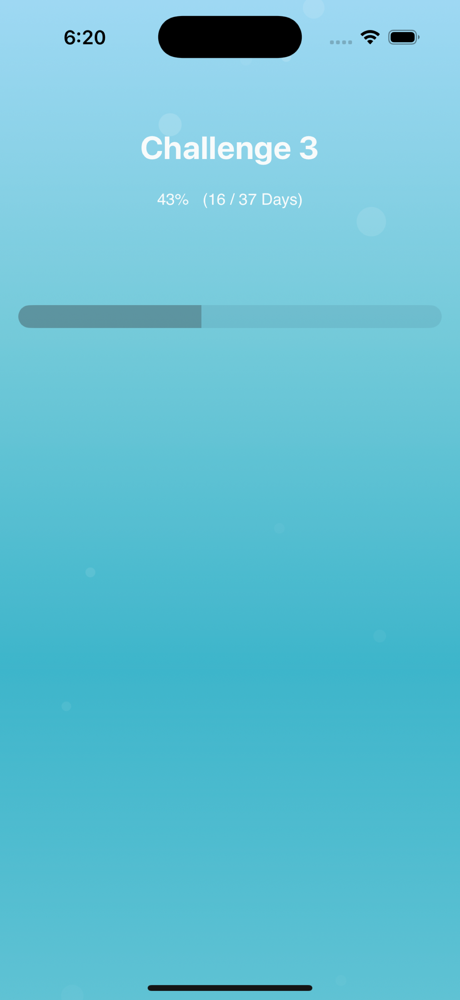

# 🌊 DibyDot

> Apple Developer Academy의 여정을 해저 탐험에 비유하여, 러너가 오늘 자신의 위치를 시각적으로 확인할 수 있도록 설계된 iOS 앱입니다.

  

## 📌 프로젝트 개요

기존의 복잡한 기능들을 제거하고, Apple Developer Academy의 10개월 여정에서
러너가 **오늘 내가 어디쯤 와 있는지**를 한눈에 확인할 수 있도록 구성된 앱입니다.

* 전체 여정 및 각 Cycle에 대한 **진행률 시각화** 제공
* UI는 해저 탐험 콘셉트에 맞춘 **Bubble 애니메이션**과 Gradient 배경 기반

---

## 🔍 핵심 기능

| 기능     | 설명                                     |
| ------ | -------------------------------------- |
| 전체 진행률 | 전체 여정(Overall Cycle)의 % 진행률을 시각적으로 표현  |
| 개별 진행률 | 오늘 날짜가 속한 Cycle의 진행 상황을 TabView로 전환 가능 |
| 자동 포커스 | 날짜 기반으로 현재 Cycle 자동 포커싱                |
| 감성 UI  | 바다색 배경 + 버블 애니메이션 + 카운트다운 스타일 진행 바     |

---

## ⚙️ 개발 환경

* **macOS** : Sequoia 15.4
* **Xcode** : 16.2
* **iOS SDK** : 18.2
* **Swift** : 6.0.3
* **UI Framework** : SwiftUI

---

## 🛠 구조 개요

* `MainView` : 전체 UI 흐름 제어, `SplitView` 기반 상하 구성
* `CycleProgressView` : 전체 또는 개별 Cycle 진행률 표현
* `ProgressTextView` : 날짜 기반 진행률 텍스트 표시 (예: 53% · 20/38일)
* `CycleTitleView` : 현재 표시 중인 Cycle 이름 출력
* `BubbleBackgroundView` : 배경 그래픽 구성 (버블 + Gradient)

---

## 📱 앱 미리보기

| 전체 Progress | 개별 Cycle |
|----------|------------|
|||

## 🙋🏻‍♀️ 작성자

| 이름 | GitHub |
|------|--------|
| Yang Seolin (Bisor0627) | [@bisor0627](https://github.com/bisor0627) |

## 📝 라이선스

이 프로젝트는 MIT 라이선스를 따릅니다. 자세한 내용은 [LICENSE](LICENSE) 파일을 참고하십시오.

## 🗂 프로젝트 관리

- **[프로젝트 보드](https://github.com/users/bisor0627/projects/5)**  
- **[이슈 현황](https://github.com/bisor0627/DiverCompass/issues)**  
  
  
