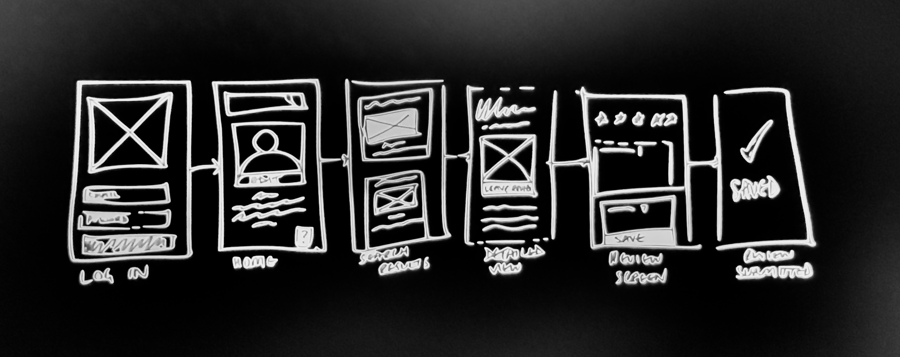
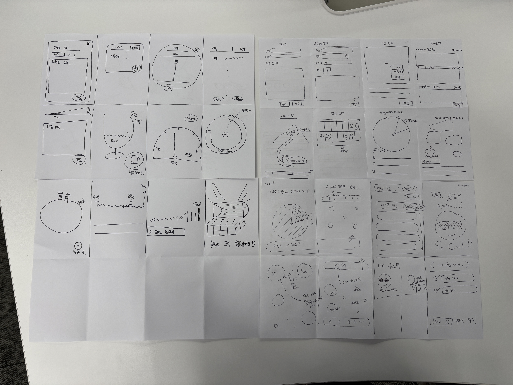
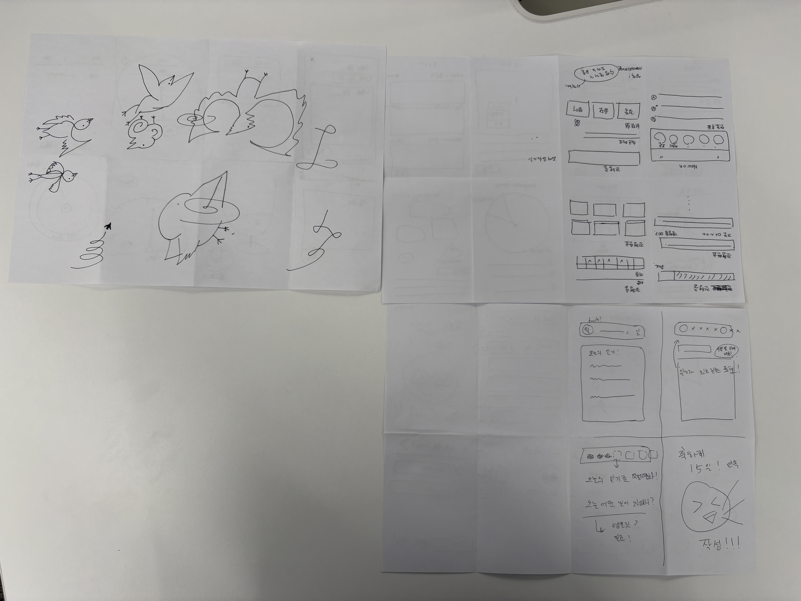

# 🧭 Exploratory Cycle #2: Feature List → Lofi → User Flow 흐름 정리

## 🧩 Overview
이번 문서는 DiverCompass의 두 번째 사이클인 **Exploratory Cycle #2**의 전 과정을 정리합니다.  
초기 기능 아이디어(Feature List)부터 Lofi 스케치, 그리고 User Flow 도출까지,  
핵심 기능이 어떻게 사용자 흐름과 시각 구조로 연결되는지 기록했습니다.


## 1️⃣ Feature List: 기능 아이디어의 구체화

### 🧠 Guiding Questions
- 목표를 어떤 기능으로 나누어 구현할 수 있을까?
- 빠르게 실험하기 위한 최소 기능은 무엇일까?
- CLI에서 구현 가능한 범위와, 앱에서 확장 가능한 영역은 어떻게 구분되는가?

### 🔧 Activities / Resources
- CLI 구조 설계
- 기능별 우선순위 설정 (핵심 vs Backlog)
- 유사 앱 리서치 (Habitica, Notion 등)
- 아카데미 챌린지 구조 해석


### ✅ 1차 Feature List

| 기능 | 설명 | CLI 구현 여부 |
|------|------|----------------|
| 전체 여정의 진행률 보기 | 전체 챌린지 기간 중 현재 사이클 위치를 계산 | ✅ |
| 현재 여정의 진행률 보기 | 각 사이클의 Day 기반 진행률 계산 | ✅ |
| 전체 목표 입력/보기 | 전체 여정의 방향성 입력 및 조회 | ✅ |
| 사이클별 목표 입력/수정 | 각 사이클 목표 작성 및 수정 | ✅ |
| 기준 날짜 수동 입력 | 테스트용 날짜 기준 진행률 계산 | ✅ |


### 🔁 Lofi 이후 업데이트된 Feature List

Lofi와 User Flow를 그려보며 **실제로 필요한 기능**과 **빠졌던 요소**들을 재정의했습니다.  
특히 **회고 기능**은 단순 부가기능이 아닌, **사용자 루틴의 핵심 흐름**으로 올라왔습니다.

| 기능 | 설명 | CLI 구현 여부 |
|------|------|----------------|
| 매일 회고 작성 | 하루를 돌아보는 짧은 메모 저장 | ✅ |
| 사이클 회고 작성 | 사이클 종료 시 회고 저장 | ✅ |


### 🔸 확장 기능 (Backlog)

| 기능 | 설명 | CLI 구현 여부 |
|------|------|----------------|
| 응원 메시지 | 시각적 리마인드 & 텍스트 기반 응원 | ⬜️ |
| 물방울 애니메이션 | 진행률 변화 시 감성적 피드백 UI | ⬜️ |
| 나침반 테마 UI | 해저 탐험 세계관을 반영한 UI 디자인 | ⬜️ |
| 회고 요약 피드백 | 이전 회고 리마인드, 회고 요약 노출 | ⬜️ |

> ✅ **Check**: Feature List에 Lofi에서 확인된 기능들이 반영되었는지 교차검토 완료


## 2️⃣ User Flow 정리

### 💬 User Flow란?
> 사용자가 앱에서 특정 목표를 달성하기 위해 거치는 흐름.  
> 기능 단위보다 **"사용자의 목적 중심"**으로 흐름을 정리함.

[](https://www.nngroup.com/articles/user-journeys-vs-user-flows/)

### ✅ 예시 흐름 구조
예: "배달앱으로 커피 시키기"
```
1. 카페 검색 → 2. 메뉴 담기 → 3. 배송지 입력 → 4. 결제
```

### ✅ DiverCompass 핵심 플로우 예시

| Flow | 설명 |
|------|------|
| Flow 1 | 앱 실행 → 전체 목표 설정 |
| Flow 2 | 새로운 사이클 진입 → 해당 사이클 목표 설정 |
| Flow 3 | 메인 화면 → 진행률 확인 → 더블탭으로 전체 여정 진행률 보기 |
| Flow 4 | 하루 종료 → 회고 작성 (텍스트) |
| Flow 5 | 사이클 종료 → 사이클 회고 기록 |
| Flow 6 | 과거 회고/목표 열람 → 동기 리마인드 |


### ✅ Success Criteria
- 사용자의 Goal(“성장과 목표 유지”)이 드러나는가?
- 각 Flow에 필요한 정보 / UI 구성이 분명한가?
- 자연스러운 전환(탭/더블탭 등)이 정의되었는가?
- 기능과 화면의 역할이 명확히 분리되어 있는가?


## 3️⃣ Lofi 스케치 정리

### 💬 Lofi란?
> 개발 이전, 빠르고 간단하게 UI/UX 아이디어를 시각적으로 표현하는 **구조/흐름 중심의 손그림 프로토타입**
> 팀 내 커뮤니케이션과 반복적인 개선을 위한 프로토타입 역할
> 빠르게 생각을 시각화하고, 기능을 검토할 수 있는 도구  



### ✅ Success Criteria
- [x] Feature들이 적절한 User Flow로 연결되어 있는가?
- [x] 각 화면이 나타내야 할 콘텐츠와 입력 구조를 명확히 포함하는가?
- [x] 적절한 UI 컴포넌트 및 패턴으로 표현되었는가?

#### ✅ Lofi 구성 체크리스트 (멘토 피드백 기반 반영 후 추가)

- [x] 화면 간 전환이 막혀있지 않은가?
- [x] 각 화면의 진입/이탈 흐름이 명확한가?
- [x] Feature List 상 기능이 누락되지 않았는가?
- [x] "기능 명세"와 "화면 명세"가 구분되어 있는가?


### 🎨 제작 방식
- Crazy 8 (1분 1개) + 팀 브레인스토밍 기반
- 꼬부랑 선 → 새 그리기 등의 손풀기로 시각적 전환
- 빠르고 품질 낮아도 아이디어를 다양하게 표현함


|  |   |
| ------------------------ | ------------------------- |

## 📝 회고 및 결론

- 초기에는 단순한 기능 나열(Feature List)에 가까웠지만,
  Lofi와 User Flow를 통해 실제 사용자 경험 흐름이 구체화됨
- **회고 기능**은 핵심 루틴이자 리마인드 요소로 기능 위치가 격상됨
- CLI로 먼저 실험 가능한 핵심 기능과, 추후 확장할 감성적 UI 요소가 구분됨
- 전체적으로 **CBL 기반 탐구-설계-구현-회고**의 첫 완성 사이클이 마무리됨 ✅
