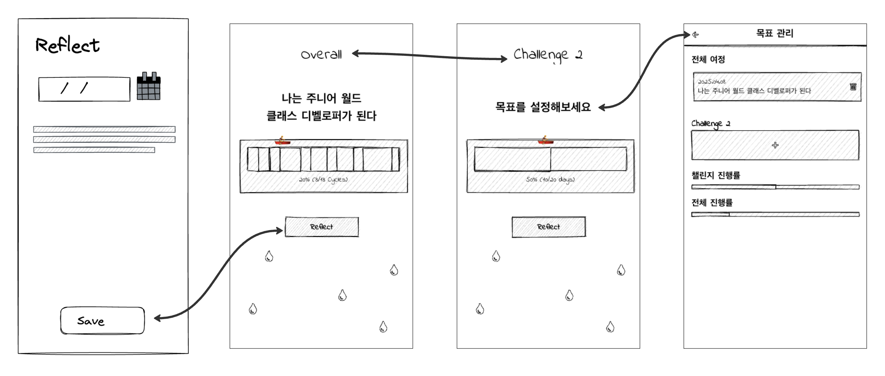
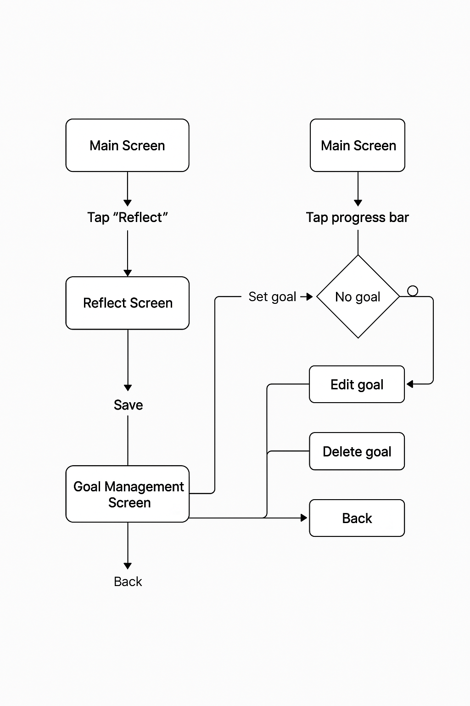

# 🧭 Exploratory Cycle #3: Feature List → UI Component & User Flow → Lo-fi

## 1️⃣ Guiding Questions

- 기능은 어떻게 UI 요소로 적절히 표현될 수 있을까?
- 사용자의 실제 흐름에서 빠진 기능은 없는가?
- 감성적 UI(물방울, 수영자 등)는 기능적 목적과 어떻게 연결되는가?
- 목표/회고 흐름을 사용자가 직관적으로 인식할 수 있을까?

## 2️⃣ Activities / Resources

- 기능 목록을 기준으로 주요 흐름 (목표 관리, 회고 작성) 재정의
- 각 기능에 알맞은 UI 컴포넌트 정의 (텍스트, 버튼, 퍼센트바 등)
- 손그림 기반 UI 스케치 제작 (Reflect, Goal Manage, Main View)
- 사용자 흐름(User Flow) 도식화 (텍스트 → 이미지 변환)
- Medium 아티클 참고: [How to Turn Lo-fi Prototypes to High-fi](https://medium.com/@moyosoreale/how-to-turn-lo-fi-prototypes-to-high-fi-from-a-user-researchers-perspective-3359231c9a5a)

## 3️⃣ Key Findings & Design Decisions

- **목표는 전체/사이클당 1개만 등록 가능** → UI에서 조건부 노출로 설계
- **수영자+파도 이모지 기반 진행률 표현** → 사용자에게 위치 인식 제공
- **회고는 물방울 UI로 표현** → 감성적 피드백 + 간단 회고 가능
- **모든 View는 Cycle View / Overall View 전환 가능** → 흐름 점검 중심
- **Reflect Flow**와 **GoalManage Flow**는 독립적으로 UX 설계되었으나 서로 유기적으로 연결됨
- CLI 구조에서의 Feature → 앱 구조로 적절히 맵핑되었음

## 4️⃣ 산출물

### ✅ Lo-fi 스케치

- Main 화면 (진행률 + 목표 표시, 뷰 전환 포함)
- GoalManage 화면 (전체/사이클 목표 관리 UI)
- Reflect 화면 (1줄 입력, 물방울 UI로 표현)

### ✅ User Flow 다이어그램

- Reflect Flow: 회고 작성 → 저장 → 메인 반영
- GoalManage Flow: 목표 등록/삭제 → 뷰 반영

## ✅ Success Criteria Review & Improvements

### ✔️ Feature → Flow 매핑
각 기능이 Reflect Flow, GoalManage Flow 등으로 자연스럽게 연결되었으며, CLI 실험을 기반으로 기능 흐름을 유기적으로 매핑함.

→ 개선: Flow 단계별 화면 이동 (From → To → Result)을 구체적으로 표기할 수 있음.

### ✔️ 화면별 콘텐츠 & 입력 형태 구성
각 화면에 필요한 UI 요소와 역할은 충실히 표현됨. 특히 상태 기반 UI 제어가 잘 설계되었음.

→ 개선: 각 화면의 구성 요소를 “입력/출력” 관점에서 재정의하면 사용자 요구와 UI 패턴을 명확히 매칭할 수 있음.

### ✔️ UI Component & 패턴 사용
감성적 UI 요소(수영자, 물방울 등)가 기능적 피드백과 연결됨. 또한 조건부 UI 노출 (예: 목표 등록 상태에 따른 버튼 노출)은 UX 측면에서 효과적임.

→ 개선: 사용된 UI 요소들을 컴포넌트 관점에서 명시하고, 향후 Hifi 구현을 위한 연결성을 높일 수 있음.

## 5️⃣ 회고

- 생각보다 기능을 UI로 옮기는 데 있어 조건 분기(있는 경우/없는 경우 등) 고려가 많았음
- CLI 실험을 먼저 했던 덕분에 기능 흐름 설계가 훨씬 자연스러웠음
- 감성적 요소(파도, 물방울)가 단순한 시각화가 아니라 실제 기능 흐름과 연결되도록 설계함
- 앞으로의 Hifi에서는 **정보 우선순위**와 **상태 변화에 따른 피드백**을 더 세밀히 설계해야 할 것 같음